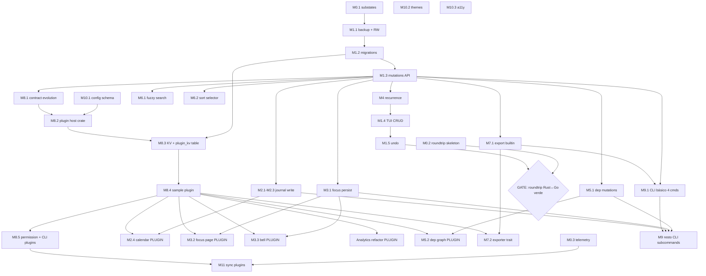

# Grafo de dependencias + batches paralelos

Cada tarea del [ROADMAP](ROADMAP.md) clasificada por: dependencias hard, oportunidad de paralelizar, ruta crítica.

## Grafo de dependencias (mermaid)



## Tabla de batches paralelos

Cada batch puede ejecutarse simultáneamente (varios workers/sesiones). Filas dentro del batch = streams independientes.

### Batch 0 — Kickoff (todo paralelo, sin deps)

| Stream | Tarea | Estimación |
|---|---|---|
| A | M0.1 AppState substates | 1-2n |
| B | M0.3 telemetry + crash reporter | 1n |
| C | M10.1 config schema | 0.5n |
| D | M10.2 themes (dark/light/HC) | 1n |
| E | M10.3 a11y (NO_COLOR, reduced-motion) | 0.5n |
| F | M0.2 roundtrip harness skeleton (sin ejecutar todavía) | 1n |

**Wall-clock con 6 workers:** 2 noches. **Total work:** 5 noches.

### Batch 1 — Backup foundation

| Stream | Tarea | Bloqueado por |
|---|---|---|
| A | M1.1 backup + RW connection | M0.1 |

**Wall-clock:** 1 noche. Solo. Critical path.

### Batch 2 — Migrations

| Stream | Tarea | Bloqueado por |
|---|---|---|
| A | M1.2 migrations + lock cooperativo | M1.1 |

**Wall-clock:** 1 noche. Critical path.

### Batch 3 — Mutations API

| Stream | Tarea | Bloqueado por |
|---|---|---|
| A | M1.3 domain mutations API | M1.2 |

**Wall-clock:** 2 noches. Critical path. **Aquí explota el fan-out.**

### Batch 4 — Massive fan-out (8 streams paralelos)

| Stream | Tarea | Estimación | Bloqueado por |
|---|---|---|---|
| A | M4 recurrence engine + tests Go portados | 3-4n | M1.3 |
| B | M7.1 export builtin (md/json/ndjson) | 1n | M1.3 |
| C | M5.1 dep mutations + cycle detection | 1n | M1.3 |
| D | M2.1-M2.3 journal write core | 3n | M1.3 |
| E | M3.1 focus session persistence | 2n | M1.3 |
| F | M6.1 fuzzy search (nucleo) | 1n | M1.3 |
| G | M6.2 sort selector | 1n | M1.3 |
| H | M8.1 plugin contract evolution | 2n | M1.3 design freeze |

**Wall-clock con 8 workers:** 4 noches. **Total work:** 14-15 noches.

Este es el batch que **más se beneficia de paralelización**. Si vas solo: 14-15 noches secuencial. Si tenés 4 colaboradores: ~4 noches.

### Batch 5 — Convergencia parcial

| Stream | Tarea | Estimación | Bloqueado por |
|---|---|---|---|
| A | M1.4 TUI CRUD wire | 3-4n | M4 (Batch 4 A) |
| B | M8.2 plugin host crate skeleton + extism | 3n | M8.1, M10.1 |

**Wall-clock con 2 workers:** 4 noches. Critical path se bifurca.

### Batch 6 — Tres streams paralelos

| Stream | Tarea | Estimación | Bloqueado por |
|---|---|---|---|
| A | M1.5 undo stack | 2n | M1.4 |
| B | M8.3 KV host-functions + plugin_kv table | 2n | M8.2, M1.2 |
| C | M9.1 CLI básico 4 cmds (add/list/done/export) | 2n | M7.1, M1.3 |

**Wall-clock con 3 workers:** 2 noches.

### Batch 7 — GATE + sample plugin

| Stream | Tarea | Bloqueado por |
|---|---|---|
| A | **GATE:** correr roundtrip Rust↔Go contra M1+M4 verdes. Si pasa → quitar `--write` flag default. | M1.5, M0.2 |
| B | M8.4 sample plugin: quote-of-the-day | M8.3 |

**Wall-clock con 2 workers:** 1 noche (GATE) + 1 noche (sample). Crítico para Batch 8.

### Batch 8 — Plugin explosion (7 streams paralelos)

Aquí está la gran ventaja de haber adelantado M8: 7 features que iban a ser core ahora son plugins independientes con M8.4 como template.

| Stream | Tarea | Estimación | Bloqueado por |
|---|---|---|---|
| A | M2.4 calendar widget plugin | 2n | M8.4, M2.1 |
| B | M3.2 focus page + heatmap plugin | 3n | M8.4, M3.1 |
| C | M3.3 pomodoro bell plugin | 1n | M8.4, M3.1 |
| D | Analytics dashboard refactor → plugin | 2n | M8.4 |
| E | M5.2 dep graph plugin | 2n | M8.4, M5.1 |
| F | M7.2 exporter trait + sample exotic exporter | 1n | M8.4, M7.1 |
| G | M8.5 permission prompt + plugins CLI | 2n | M8.4 |

**Wall-clock con 7 workers:** 3 noches. **Total work:** 13 noches.

### Batch 9 — Cierre

| Stream | Tarea | Estimación | Bloqueado por |
|---|---|---|---|
| A | M9 resto CLI subcommands (12 cmds) | 3-4n | M9.1, M2.1, M3.1, M5.1 |
| B | M11 sync plugin (uno de los 3) | 5+n | M8.5, M0.3 |

**Wall-clock con 2 workers:** 5 noches.

---

## Críticas paths

### Path A (writes default ON)
```
M0.1 → M1.1 → M1.2 → M1.3 → M4 → M1.4 → M1.5 → GATE → ✓
1-2n   1n    1n    2n    3-4n  3-4n   2n    1n    = 14-15 noches
```

### Path B (plugin loader funcional)
```
M0.1 → M1.1 → M1.2 → M1.3 → M8.1 → M8.2 → M8.3 → M8.4 → ✓
1-2n   1n    1n    2n    2n    3n    2n    1n    = 13-14 noches
```

**Las dos paths convergen alrededor de las 14 noches.** A partir de ahí, el grueso del trabajo es paralelo.

---

## Esquema de paralelización por nivel de recurso

### Si vas solo (1 worker)
Secuencial. Estimación total: **51-66 noches** (15-20 semanas weekend-pace).

### Si tenés 2-3 workers
Aprovechás Batch 0 (6 streams) y Batch 4 (8 streams). Tiempo total: **~30-35 noches** (~10 semanas).

### Si tenés 4-6 workers
Batch 4 y Batch 8 se completan en wall-clock cercano al máximo del stream individual. Tiempo total: **~20-25 noches** (~6-8 semanas).

### Si tenés 7+ workers
Plugin explosion (Batch 8) ya no escala más allá de 7. Cuello: critical path de 14 noches. Tiempo total: **~17-20 noches** (~5-6 semanas).

---

## Reglas prácticas para paralelizar

1. **Antes de M1.3**: solo 1-2 workers efectivos. Backup + migrations son secuenciales.
2. **Entre M1.3 y M1.4**: ventana de **8 streams paralelos** (Batch 4). Máximo retorno aquí.
3. **Entre M8.4 y M9**: ventana de **7 streams paralelos** (Batch 8). Plugins independientes.
4. **Coordinación crítica:** M8.1 (contract evolution) debe estar 80% diseñado antes de empezar M8.2-M8.5 + plugins (Batch 4 H, Batch 8 A-G). Cambios al contrato post-Batch-8 cuestan caro.
5. **M0.2 roundtrip harness:** desde Batch 0 conviene tenerlo escrito aunque no pase. Sin él, el GATE de Batch 7 es subjetivo.
6. **Tests E2E entre streams:** después de Batch 4, ejecutar suite completa antes de avanzar a Batch 5. M4 + M5.1 + M3.1 escriben tablas distintas pero comparten transacciones.
7. **Conflict zone:** M2 + M5 + M6 todos tocan UI navegación. Si dos workers tocan `event.rs` o `app.rs` simultáneamente → merge hell. Mejor: 1 worker dueño de `event.rs`/`app.rs` durante Batch 4, otros sobre `core` + sus propios componentes.

---

## Matriz de archivos por stream (Batch 4)

Para evitar conflicts en Batch 4 (el más ancho), asignación recomendada:

| Stream | Archivos exclusivos | Archivos compartidos (cuidado) |
|---|---|---|
| A — M4 recurrence | `crates/rondo-core/src/recurrence.rs`, tests | `domain/task.rs` (sólo lectura) |
| B — M7.1 export | `crates/rondo-core/src/export.rs` | — |
| C — M5.1 deps | `store/sqlite.rs` (sección deps) | `domain/task.rs` |
| D — M2 journal | `store/sqlite.rs` (sección journal), `components/journal.rs` | `app.rs` (action handlers) |
| E — M3.1 focus | `store/sqlite.rs` (sección focus_sessions), `components/pomodoro.rs` | `app.rs` |
| F — M6.1 search | `components/search.rs` | `app.rs` |
| G — M6.2 sort | nuevo `components/sort_overlay.rs` | `app.rs`, `event.rs` |
| H — M8.1 contract | `crates/rondo-plugin-api/src/*` | — |

**Punto caliente:** `store/sqlite.rs` (3 streams escribiendo). Soluciones:
- (a) Splittear en `store/{task,journal,focus,deps}.rs` antes del Batch 4 (es parte de M0.1 refactor).
- (b) Rebasar antes que pushear, rotar el lock.

`app.rs` y `event.rs` también son compartidos. Mismo trato: si M0.1 partió en substates, cada substate vive en su archivo → menos conflicts.

---

## Resumen

- **Critical path:** ~14 noches secuenciales hasta GATE + plugin host operativo.
- **Máximo paralelismo:** Batch 4 (8 streams) y Batch 8 (7 streams).
- **Cuello de botella:** M1.3 (mutations API). Hasta que cierre, todo lo demás de Batch 4 espera.
- **Optimización clave:** invertir noche extra en M0.1 (partir `app.rs` y `store/sqlite.rs` en submódulos) duplica el throughput de Batch 4.
- **Decisión humana, no automatizable:** el GATE de Batch 7 ("roundtrip Rust↔Go verde") es subjetivo. Sin esa validación, quitar el `--write` flag default es ruleta rusa.
